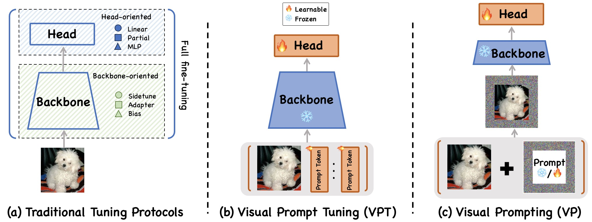
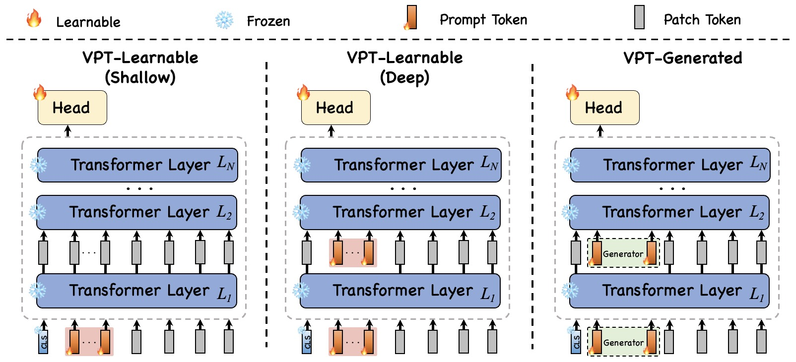
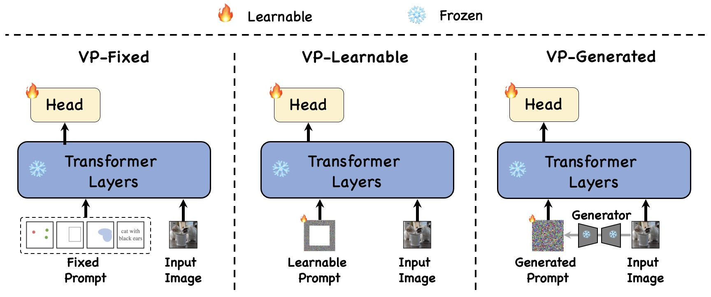

<h1 align="center">Prompt-based Adaptation in Large-scale Vision Models: A Survey</h1>

<div align="center">

[](https://openreview.net/forum?id=UwtXDttgsE)
[](https://arxiv.org/abs/2510.13219)
[](https://openreview.net/forum?id=UwtXDttgsE)
[](https://yunbeizhang.github.io/Awesome-Visual-Prompt-Tuning/)
[](https://github.com/yunbeizhang/Awesome-Visual-Prompt-Tuning)
[]()
[](http://makeapullrequest.com)

*A curated list of papers, resources and tools on **Prompt-Based Adaptation (PA)** for large-scale vision models.*

**Accepted to [Transactions on Machine Learning Research (TMLR)](https://jmlr.org/tmlr/) 2026**

[Xi Xiao]()\*, [Yunbei Zhang]()\*, [Lin Zhao]()\*, [Yiyang Liu]()\*, [Xiaoying Liao](), [Zheda Mai](), [Xingjian Li](), [Xiao Wang](), [Hao Xu](), [Jihun Hamm](), [Xue Lin](), [Min Xu](), [Qifan Wang](), [Tianyang Wang]()†, [Cheng Han]()†

</div>

---

<p align="center">
  
</p>

## News

- **[Feb 2026]** Paper accepted to **TMLR**!
- **[Oct 2025]** Preprint available on [arXiv](https://arxiv.org/abs/2510.13219).

## Introduction

Large vision models are typically pretrained on massive datasets and then finetuned for downstream tasks. Full finetuning is expensive and may erode pretrained knowledge. **Prompt-Based Adaptation (PA)** introduces small prompt parameters while freezing the backbone, efficiently steering pretrained models to new tasks.

This survey provides the **first comprehensive and unified overview of PA in large vision models**. We define PA as a framework covering both:
- **Visual Prompting (VP)**: modifies the input image via pixel-space prompts.
- **Visual Prompt Tuning (VPT)**: injects learnable tokens inside the network.

We further categorize methods by their generation mechanism into **fixed**, **learnable**, and **generated** prompts.

<p align="center">
  
  <br><em>Illustration of VPT variants: Shallow, Deep, and Generated.</em>
</p>

<p align="center">
  
  <br><em>Illustration of VP variants: Fixed, Learned, and Generated.</em>
</p>

---

## Table of Contents

- [Unified Taxonomy](#unified-taxonomy)
  - [Visual Prompting (VP)](#visual-prompting-vp)
  - [Visual Prompt Tuning (VPT)](#visual-prompt-tuning-vpt)
  - [Efficiency Considerations](#efficiency-considerations)
- [Foundational CV Tasks](#foundational-cv-tasks)
- [Domain-Specific Applications](#domain-specific-applications)
- [PA under Constrained Learning](#pa-under-constrained-learning)
- [Trustworthy AI](#trustworthy-ai)
- [Foundational Analysis & Theory](#foundational-analysis--theory)
- [Discussion & Challenges](#discussion--challenges)
- [Related Surveys](#related-surveys)
- [Citation](#citation)
- [Contributing](#contributing)

---

## Unified Taxonomy

PA methods are categorized by *where* prompts are injected (input vs. token space) and *how* they are obtained (fixed, learnable, generated).

### Visual Prompting (VP)

VP modifies the input before tokenization/feature extraction. Prompts are applied directly to pixels:

- **VP-Fixed**: no learnable parameters — static boxes, points, or masks (e.g., SAM).
- **VP-Learnable**: optimize pixel-space overlays, frequency cues, or masks (e.g., Fourier VP, OT-VP).
- **VP-Generated**: a generator produces adaptive image-level prompts (e.g., BlackVIP).

| Title | Venue | Year | Type | Notes |
|:------|:------|:------|:------|:------|
| [Exploring Visual Prompts](https://arxiv.org/abs/2203.17274) | NeurIPS | 2022 | Learnable | Foundational VP |
| [Visual Prompting via Inpainting](https://arxiv.org/abs/2209.00647) | NeurIPS | 2022 | Generated | Inpainting-based |
| [BlackVIP](https://arxiv.org/abs/2303.14773) | CVPR | 2023 | Generated | Zeroth-order black-box |
| [Fourier Visual Prompting](https://arxiv.org/abs/2212.10556) | TMLR | 2024 | Learnable | Frequency-domain cues |
| [OT-VP](https://arxiv.org/abs/2404.09231) | 2025 | Learnable | Optimal transport alignment |
| [Custom SAM](https://arxiv.org/abs/2306.05385) | 2023 | Learnable | Medical segmentation |

### Visual Prompt Tuning (VPT)

VPT inserts learnable tokens into frozen model layers:

- **VPT-Learnable**: prompt tokens are trained via gradient descent (shallow or deep injection).
- **VPT-Generated**: small networks produce adaptive prompt tokens.

| Title | Venue | Year | Type | Notes |
|:------|:------|:------|:------|:------|
| [VPT](https://arxiv.org/abs/2203.12119) | ECCV | 2022 | Learnable | Foundational method |
| [E2VPT](https://arxiv.org/abs/2307.13770) | ICCV | 2023 | Learnable | Key-value prompts + pruning |
| [LPT](https://arxiv.org/abs/2210.01033) | ICLR | 2023 | Learnable | Long-tailed classes |
| [SA2VP](https://arxiv.org/abs/2312.10376) | AAAI | 2024 | Learnable | Spatially aligned 2D map |
| [LSPT](https://arxiv.org/abs/2312.12276) | CVPR | 2024 | Generated | Long-term spatial prompts |
| [DVPT](https://arxiv.org/abs/2505.04119) | NN | 2025 | Generated | Cross-attention generator |

### Efficiency Considerations

- **VPT** reduces parameter/optimizer footprint (<0.5% of backbone parameters) but activation memory remains.
- **VP-Fixed** enables training-free adaptation with zero prompt-side gradients.
- **VP** is black-box friendly: zeroth-order optimization avoids storing parameter gradients entirely.

---

## Foundational CV Tasks

- **Segmentation**: Prompt-driven continual, multimodal, and few-shot segmentation (SAM-adapters, SA2VP).
- **Restoration & Enhancement**: Degradation-aware prompts for denoising, dehazing, deraining (PromptIR, PromptRestorer).
- **Compression**: Prompt tokens control rate-distortion trade-offs in Transformer codecs.

---

## Domain-Specific Applications

| Domain | Representative Methods |
|:-------|:----------------------|
| **Medical & Biomedical** | CusSAM, Ma-SAM, DVPT for segmentation & reporting |
| **Remote Sensing & Geospatial** | RSPrompter, ZoRI, PHTrack |
| **Robotics & Embodied AI** | PointCLIP, ShapeLLM, GAPrompt |
| **Industrial Inspection** | ClipSAM, SAID for defect detection |
| **Autonomous Driving** | Severity-aware prompts for adverse conditions |
| **3D Point Clouds & LiDAR** | PointLoRA, PromptDet |

---

## PA under Constrained Learning

| Paradigm | Description |
|:---------|:------------|
| **Test-Time Adaptation** | On-the-fly prompt tuning (DynaPrompt, C-TPT) |
| **Continual Learning** | Task-incremental prompt pools |
| **Few-Shot / Zero-Shot** | Prompt-based transfer with limited labels |
| **Black-Box** | Zeroth-order learning (BlackVIP) |
| **Federated Learning** | Decentralized personalized prompts (FedPrompt) |
| **Source-Free** | Adaptation without source data (DDFP) |

---

## Trustworthy AI

PA contributes to **robustness**, **fairness**, and **privacy**:
- Robust prompts improve adversarial resistance.
- Fairness prompts mitigate demographic bias.
- Privacy prompts protect sensitive visual data.

---

## Foundational Analysis & Theory

The survey examines behavioral evidence and theoretical underpinnings of how prompts steer frozen representations, including attention pattern analysis, representation geometry, and expressivity bounds.

---

## Discussion & Challenges

Key open challenges identified in the survey:
1. **Safety Alignment**: Aligning prompt interventions with human values and preventing malicious use.
2. **Training Overhead & Stability**: Reducing hyperparameter search costs and seed sensitivity.
3. **Inference Latency**: Mitigating added memory/compute from prompt components.
4. **Real-World Evaluation**: Moving beyond academic benchmarks to complex, distribution-shifting scenarios.

---

## Related Surveys

| Title | Venue | Year |
|:------|:------|:------|
| [Prompt Learning in Computer Vision: A Survey](https://link.springer.com/content/pdf/10.1631/FITEE.2300389.pdf) | FITEE | 2024 |
| [Parameter-Efficient Fine-Tuning for Pre-Trained Vision Models](https://arxiv.org/abs/2402.02242) | arXiv | 2024 |
| [Prompt Engineering on Vision-Language Models](https://arxiv.org/abs/2307.12980) | arXiv | 2023 |
| [Visual Prompting in MLLMs](https://arxiv.org/abs/2409.15310) | arXiv | 2024 |

---

## Citation

If you find this survey useful in your research, please consider citing our paper:

```bibtex
@article{xiao2025prompt,
  title={Prompt-based Adaptation in Large-scale Vision Models: A Survey},
  author={Xiao, Xi and Zhang, Yunbei and Zhao, Lin and Liu, Yiyang and Liao, Xiaoying and Mai, Zheda and Li, Xingjian and Wang, Xiao and Xu, Hao and Hamm, Jihun and Lin, Xue and Xu, Min and Wang, Qifan and Wang, Tianyang and Han, Cheng},
  journal={Transactions on Machine Learning Research (TMLR)},
  year={2026},
  url={https://openreview.net/forum?id=UwtXDttgsE}
}
```

---

## Contributing

We welcome new papers, implementations, and corrections! Please categorize contributions under:
- VP-Fixed / VP-Learnable / VP-Generated
- VPT-Learnable / VPT-Generated
- And note the application domain (e.g., Medical, 3D, Remote Sensing).

---

## Star History

<a href="https://star-history.com/#yunbeizhang/Awesome-Visual-Prompt-Tuning&Date">
 <picture>
   <source media="(prefers-color-scheme: dark)" srcset="https://api.star-history.com/svg?repos=yunbeizhang/Awesome-Visual-Prompt-Tuning&type=Date&theme=dark" />
   <source media="(prefers-color-scheme: light)" srcset="https://api.star-history.com/svg?repos=yunbeizhang/Awesome-Visual-Prompt-Tuning&type=Date" />
   
 </picture>
</a>
